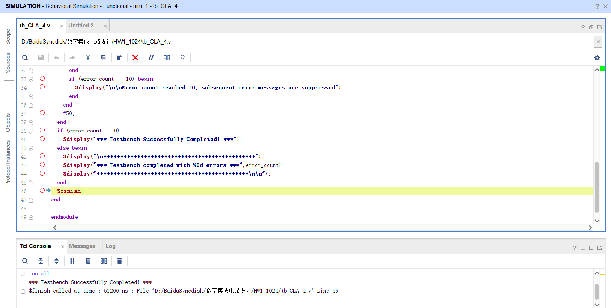
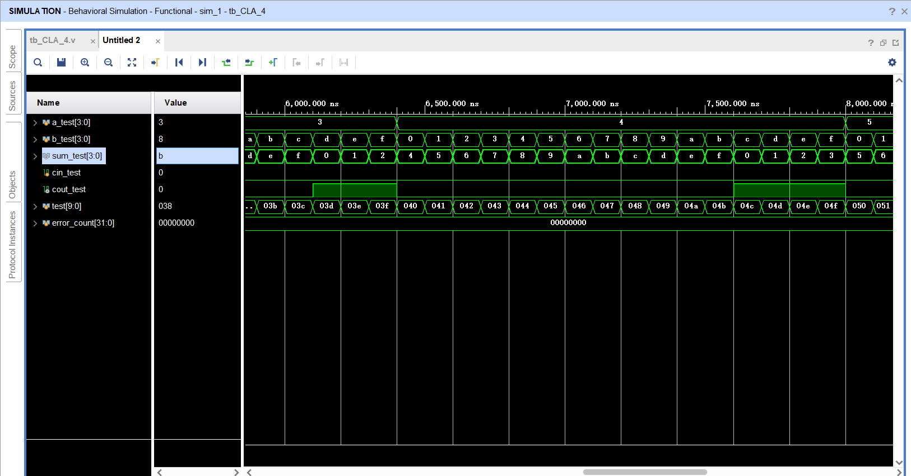
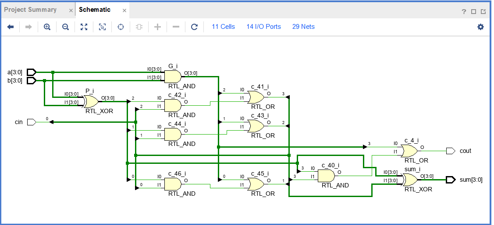
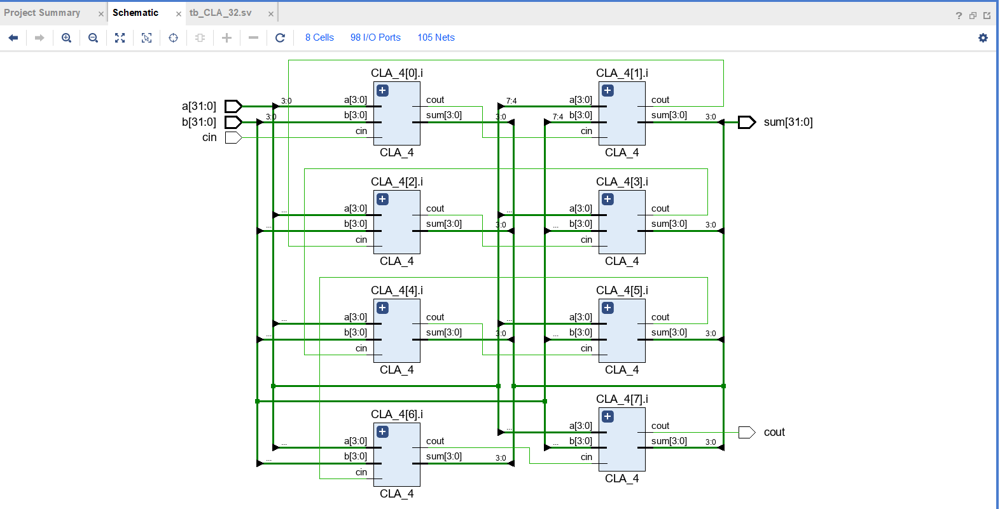
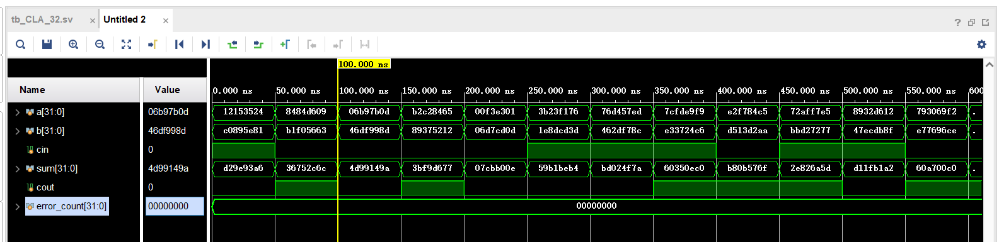
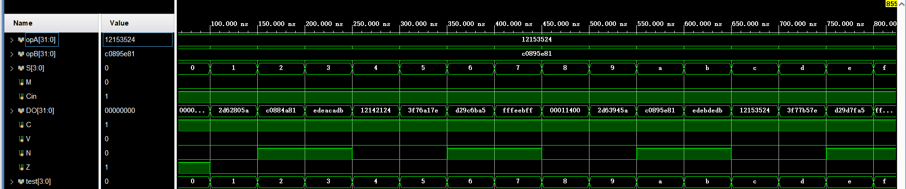
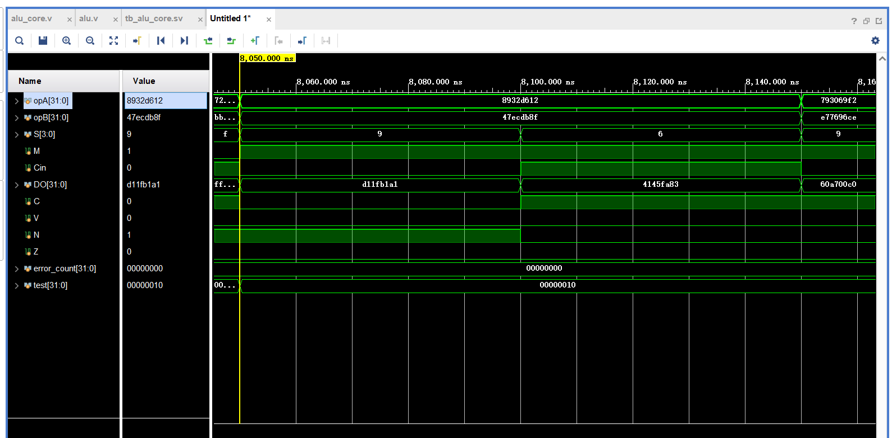
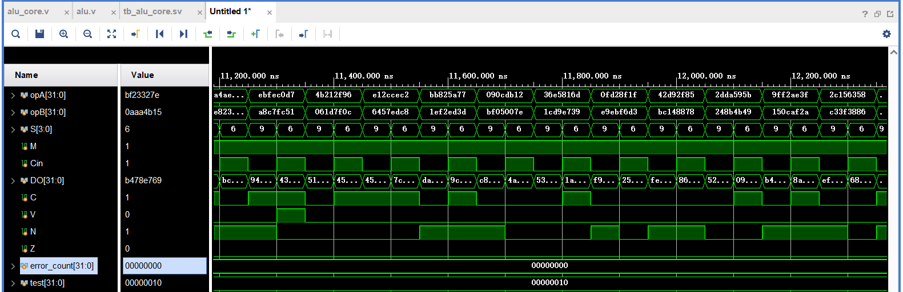

# 4位超前进位加法器(CLA_4.v)

对CLA_4进行测试，程序正常执行，结果正确。

# 32位超前进位加法器(CLA_32.v)

例化8个4位超前进位加法器即可。

给a、b、cin随机赋初值，运算结果均正确，error_count始终为0。

# ALU设计(alu_core.v)

Cin = 1 ， M = 0 ，执行逻辑运算操作。

a = 12153524(0001_0010_0001_0101_0011_0101_0010_0100)

b = c0895e81(1100_0000_1000_1001_0101_1110_1000_0001)

 S = 5，执行not B操作，结果应为(0011_1111_0111_0110_1010_0001_0111_1110)，即3f76a17e，与结果一致

S = 8 ，执行 a AND b操作，结果应为(0000_0000_0000_0001_0001_0100_0000_0000),即00011400，与结果一致

……

每种情况均符合要求

M = 1时执行算术运算，a = 8932d612， b = 47ecdb8f。

a + b = D11F B1A1 ，结果正确 。

a - b = 4145 FA83 ， 结果正确。

多次运算后，error_count始终为0，表示算数运算结果正确。

