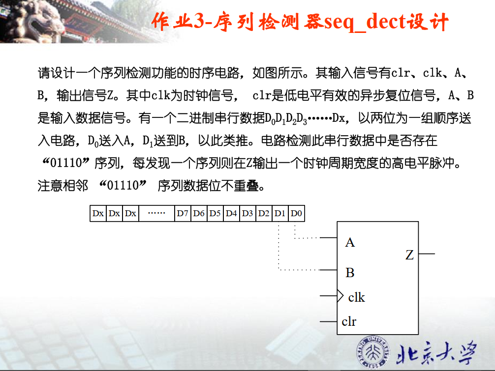

# 作业2： 4位移位器设计(shifter_4bit)  

考虑到当控制信号`ld、sr、sl`同时有效时会出现不确定的功能，给`ld`最高优先级，`sr`次之，`sl`优先级最低。

## 1、设计文件

```verilog
module shifter_4 (
	input clk		,   // Clock

	input ld		,	// Set D to Q
	input [3:0] D 	, 

	input sr  		,   // righr shift
	input D_sr		,

	input sl  		,  //  left shift
	input D_sl		,

	output reg [3:0] Q
	
);

	always @(posedge clk) begin
		if(ld) begin
			Q <= D ;
		end else begin
			if (sr) begin
				Q = {D_sr, Q[3:1]} ;
			end
			else begin
				if (sl) begin
					Q = {Q[2:0], D_sl};
				end
			end
		end
	end

endmodule
```

## 2、测试文件

```verilog

`timescale 1ns/1ps
module tb_shifter_4 (); 

	// clock
	logic clk;
	initial begin
		clk = '0;
		forever #(0.5) clk = ~clk;
	end

	// (*NOTE*) replace reset, clock, others
	logic       ld;
	logic [3:0] D;
	logic       sr;
	logic       D_sr;
	logic       sl;
	logic       D_sl;
	logic [3:0] Q;

	shifter_4 inst_shifter_4 (.clk(clk), .ld(ld), .D(D), .sr(sr), .D_sr(D_sr), .sl(sl), .D_sl(D_sl), .Q(Q));

	task init();
		ld   <= '0;
		D    <= '0;
		sr   <= '0;
		D_sr <= '0;
		sl   <= '0;
		D_sl <= '0;
	endtask

	task drive(int iter);
		for(int it = 0; it < iter; it++) begin
			ld   <= $urandom_range(0,1);
			D    <= $urandom_range(0,15);
			sr   <= $urandom_range(0,1);
			D_sr <= $urandom_range(0,1);
			sl   <= $urandom_range(0,1);
			D_sl <= $urandom_range(0,1);
			@(posedge clk);
		end
	endtask

	initial begin
		// do something

		init();
		repeat(10)@(posedge clk);

		drive(200);

		repeat(10)@(posedge clk);
		$finish;
	end
	
endmodule

```

## 3、波形分析


1. `ld` = 1时，将D置入，时钟上升沿，Q变为3
2. `sr` = 1时，右移，将`D_sr = 1 `移入，e（1110）变为f（1111）
3. `srl = 1`时，左移，将`D_sr = 0 `移入，f（1111）变为f（1110）

## 4、Schematic


# 作业3-序列检测器seq_dect设计  



## 1、设计文件

采用`moore`型状态机设计


```verilog
`timescale 1ns/1ps

module detect_01110 (
	input wire clk		,    // Clock
	input wire clr		,  // Asynchronous reset active low 
	input wire A 		,
	input wire B 		,

	output wire Z
);

	parameter IDLE 		    = 3'b000  ;
	parameter DETECT_0      = 3'b001  ;
	parameter DETECT_01     = 3'b010  ;
	parameter DETECT_011    = 3'b011  ;
	parameter DETECT_0111   = 3'b100  ;
	parameter DETECT_011100 = 3'b101  ;
	parameter DETECT_011101 = 3'b110  ;

	reg [2:0] current_state, next_state ;

	// state transfer
	always @(posedge clk or negedge clr) begin : proc_current_state
		if(~clr) begin
			current_state <= IDLE ;
		end else begin
			current_state <= next_state;
		end
	end

	// state calculate
	always @(*) begin
		case (current_state)
			IDLE:begin
				case ({A, B})
					2'b00: next_state = DETECT_0 ;
					2'b01: next_state = DETECT_01;
					2'b10: next_state = DETECT_0 ;
					2'b11: next_state = IDLE	 ; 
				 	default : next_state = IDLE;
				 endcase 
			end
			DETECT_0:begin
				case ({A, B})
					2'b00: next_state = DETECT_0  ;
					2'b01: next_state = DETECT_01 ;
					2'b10: next_state = DETECT_0  ;
					2'b11: next_state = DETECT_011; 
				 	default : next_state = IDLE	  ;
				 endcase 
			end
			DETECT_01:begin
				case ({A, B})
					2'b00: next_state = DETECT_0   ;
					2'b01: next_state = DETECT_01  ;
					2'b10: next_state = DETECT_0   ;
					2'b11: next_state = DETECT_0111; 
				 	default : next_state = IDLE	   ;
				 endcase 
			end
			DETECT_011:begin
				case ({A, B})
					2'b00: next_state = DETECT_0    ;
					2'b01: next_state = DETECT_01   ;
					2'b10: next_state = DETECT_011101;
					2'b11: next_state = IDLE	    ; 
				 	default : next_state = IDLE	    ;
				 endcase 
			end	
			DETECT_0111:begin
				case ({A, B})
					2'b00: next_state = DETECT_011100 ;
					2'b01: next_state = DETECT_011101 ;
					2'b10: next_state = DETECT_0  	  ;
					2'b11: next_state = IDLE	      ;  
				 	default : next_state = IDLE	      ;
				 endcase 
			end
			DETECT_011100:begin
				case ({A, B})
					2'b00: next_state = DETECT_0 	  ;
					2'b01: next_state = DETECT_01 	  ;
					2'b10: next_state = DETECT_0  	  ;
					2'b11: next_state = IDLE	      ;  
				 	default : next_state = IDLE	      ;
				 endcase 
			end
			DETECT_011101:begin
				case ({A, B})
					2'b00: next_state = DETECT_0 	  ;
					2'b01: next_state = IDLE	 	  ;
					2'b10: next_state = DETECT_0  	  ;
					2'b11: next_state = IDLE		  ;  
				 	default : next_state = IDLE	      ;
				 endcase 
			end
		
			default : next_state = IDLE;
		endcase
		
	end

	// state output
	assign Z = (current_state == DETECT_011100    ) 
				|| (current_state == DETECT_011101) ; // detect 01110

endmodule
```

## 2、测试文件

随机给A、B一些值进行测试

```verilog

`timescale 1ns/1ps
module tb_detect_01110 ();

	// clock
	logic clk;
	initial begin
		clk = '0;
		forever #(0.5) clk = ~clk;
	end

	// asynchronous reset
	logic clr;
	initial begin
		clr <= '0;
		#10
		clr <= '1;
	end

	// (*NOTE*) replace reset, clock, others
	parameter IDLE          = 3'b000;
	parameter DETECT_0      = 3'b001;
	parameter DETECT_01     = 3'b010;
	parameter DETECT_011    = 3'b011;
	parameter DETECT_0111   = 3'b100;
	parameter DETECT_011100 = 3'b101;
	parameter DETECT_011101 = 3'b110;

	logic A    ;
	logic B    ;
	logic Z    ;

	detect_01110 #(
		.IDLE         (IDLE         ),
		.DETECT_0     (DETECT_0     ),
		.DETECT_01    (DETECT_01    ),
		.DETECT_011   (DETECT_011   ),
		.DETECT_0111  (DETECT_0111  ),
		.DETECT_011100(DETECT_011100),
		.DETECT_011101(DETECT_011101)
	) inst_detect_01110 (
		.clk(clk),
		.clr(clr),
		.A  (A  ),
		.B  (B  ),
		.Z  (Z  )
	);

	task init();
		A   <= '0;
		B   <= '0;
	endtask

	task drive(int iter);
		for(int it = 0; it < iter; it++) begin
			A   <= $urandom_range(0,1);
			B   <= $urandom_range(0,1);
			@(posedge clk);
		end
	endtask

	initial begin
		// do something

		init();
		repeat(10)@(posedge clk);

		drive(500);

		A   <= 0;
		B   <= 1;
		@(posedge clk);

		A   <= 1;
		B   <= 1;
		@(posedge clk);

		A   <= 0;
		B   <= 0;
		@(posedge clk);

		repeat(10)@(posedge clk);
		$finish;
	end

endmodule

```

## 3、波形分析


当检测到连续的“01110”信号之后，Z会输出1，结果符合预期。


## 4、Schematic

