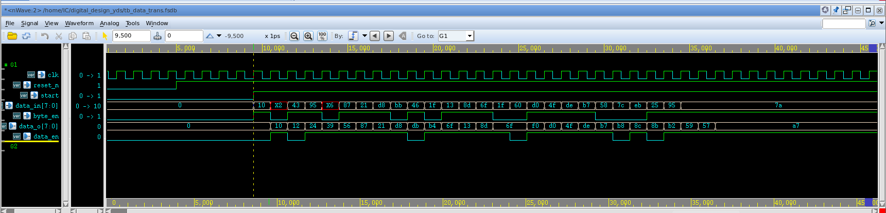
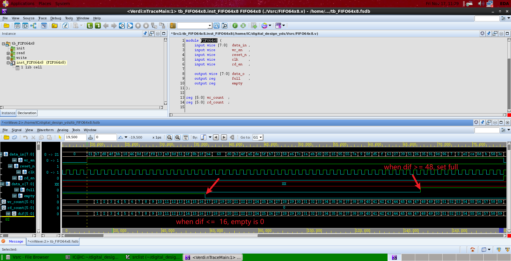
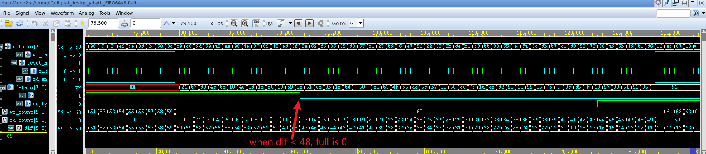
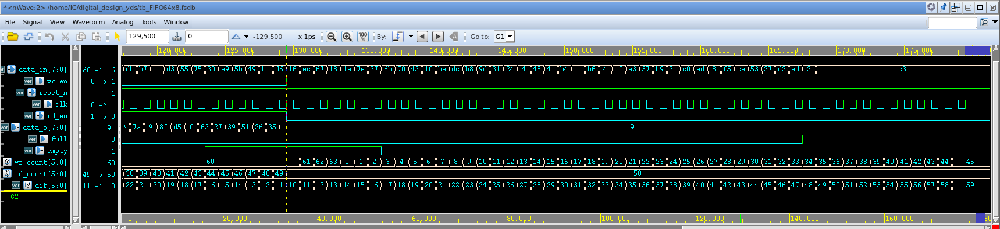
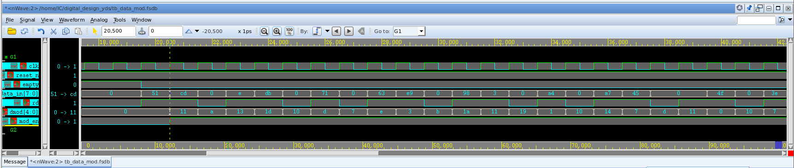
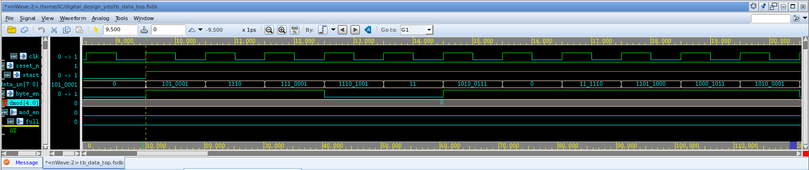
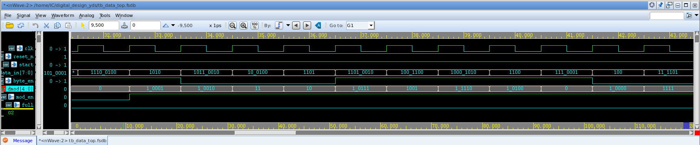

# Description


# data_trans 

## Vsrc

```verilog
module data_trans (
	input wire			clk		,    // Clock
	input wire			reset_n	,  // Asynchronous reset active low
	input wire			start 	,
	input wire	[7:0]	data_in ,
	input wire			byte_en ,

	output reg	[7:0]	data_o 	,
	output reg			data_en
);
	
	reg state 		;		// state = 0 means GET 0 BITS, state = 1 means GET 4 BITS
	reg [3:0] tmp   ;		// tmp is data_in[3:0] in the next GET 4 BITS state

	always @(posedge clk or negedge reset_n) begin
		if(~reset_n) begin
			data_o  <= 8'h00 ;
			data_en <= 1'b0  ;
			state   <= 1'b0  ;
			tmp 	<= 4'h0  ;
		end else begin
			if (start) begin
				if (byte_en == 1'b1) begin
					if (state == 1'b0) begin
						data_o  <= data_in ;
						data_en <= 1'b1    ;
						state   <= 1'b0    ;
					end else begin
						data_o  <= {tmp, data_in[7:4]} 	;
						data_en <= 1'b1 				;
						state   <= 1'b1					;
						tmp     <= data_in[3:0] 		;
					end				
				end else begin   // 4bits enable
					if (state == 1'b0) begin
						data_o  <= {data_o[7:4], data_in[3:0]} 	;
						tmp     <= data_in[3:0] 				;
						data_en <= 1'b0 						;
						state   <= 1'b1   						;
					end else begin
						data_o <= {tmp, data_in[3:0]} 	;
						data_en <= 1'b1 				;
						state <= 1'b0					;
					end
				end
			end else begin
				data_o <= 8'h00  ;
				data_en <= 1'b0  ;
			end
		end
	end

endmodulemodule data_trans (
	input wire			clk		,    // Clock
	input wire			reset_n	,  // Asynchronous reset active low
	input wire			start 	,
	input wire	[7:0]	data_in ,
	input wire			byte_en ,

	output reg	[7:0]	data_o 	,
	output reg			data_en
);
	
	reg state 		;		// state = 0 means GET 0 BITS, state = 1 means GET 4 BITS
	reg [3:0] tmp   ;		// tmp is data_in[3:0] in the next GET 4 BITS state

	always @(posedge clk or negedge reset_n) begin
		if(~reset_n) begin
			data_o  <= 8'h00 ;
			data_en <= 1'b0  ;
			state   <= 1'b0  ;
			tmp 	<= 4'h0  ;
		end else begin
			if (start) begin
				if (byte_en == 1'b1) begin
					if (state == 1'b0) begin
						data_o  <= data_in ;
						data_en <= 1'b1    ;
						state   <= 1'b0    ;
					end else begin
						data_o  <= {tmp, data_in[7:4]} 	;
						data_en <= 1'b1 				;
						state   <= 1'b1					;
						tmp     <= data_in[3:0] 		;
					end				
				end else begin   // 4bits enable
					if (state == 1'b0) begin
						data_o  <= {data_o[7:4], data_in[3:0]} 	;
						tmp     <= data_in[3:0] 				;
						data_en <= 1'b0 						;
						state   <= 1'b1   						;
					end else begin
						data_o <= {tmp, data_in[3:0]} 	;
						data_en <= 1'b1 				;
						state <= 1'b0					;
					end
				end
			end else begin
				data_o <= 8'h00  ;
				data_en <= 1'b0  ;
			end
		end
	end

endmodule
```


## Testbench

```verilog

`timescale 1ns/1ps
module tb_data_trans ();

	// clock
	logic clk;
	initial begin
		clk = '0;
		forever #(0.5) clk = ~clk;
	end

	// asynchronous reset
	logic reset_n;
	initial begin
		reset_n <= '0;
		#5
		reset_n <= '1;
	end

	// synchronous reset
	logic srstb;
	initial begin
		srstb <= '0;
		repeat(10)@(posedge clk);
		srstb <= '1;
	end

	// (*NOTE*) replace reset, clock, others
	logic       start;
	logic [7:0] data_in;
	logic       byte_en;
	logic [7:0] data_o;
	logic       data_en;

	data_trans inst_data_trans
		(
			.clk     (clk),
			.reset_n (reset_n),
			.start   (start),
			.data_in (data_in),
			.byte_en (byte_en),
			.data_o  (data_o),
			.data_en (data_en)
		);

	task init();
		start   <= '0;
		data_in <= '0;
		byte_en <= '0;
	endtask

	task drive(int iter);
		for(int it = 0; it < iter; it++) begin
			start   <= '1;
			data_in <= $urandom_range(0,255);
			byte_en <= $urandom_range(0,1 );
			@(posedge clk);
		end
	endtask

	initial begin
		// do something

		init();
		repeat(10)@(posedge clk);

		start   <= '1;
		data_in <= 8'h10;
		byte_en <= '1;
		@(posedge clk);

		data_in <= 8'hx2;
		byte_en <= '0;
		@(posedge clk);

		data_in <= 8'h43;
		byte_en <= '1;
		@(posedge clk);

		data_in <= 8'h95;
		byte_en <= '1;
		@(posedge clk);

		data_in <= 8'hx6;
		byte_en <= '0;
		@(posedge clk);

		data_in <= 8'h87;
		byte_en <= '1;
		@(posedge clk);

		drive(20);

		repeat(10)@(posedge clk);
		$finish;
	end
	// dump wave
	initial begin
		$display("random seed : %0d", $unsigned($get_initial_random_seed()));
		if ( $test$plusargs("fsdb") ) begin
			$fsdbDumpfile("tb_data_trans.fsdb");
			$fsdbDumpvars(0, "tb_data_trans");
		end
	end
endmodule

```


## Waveform



The result is in line with expectations

# FIFO

## Vsrc

```verilog
module FIFO64x8 (
    input wire [7:0]  data_in ,
    input wire        wr_en   ,
    input wire        reset_n ,
    input wire        clk     ,
    input wire        rd_en   ,

    output wire [7:0] data_o  ,
    output reg        full    ,
    output reg        empty
);

reg [5:0] wr_count  ;
reg [5:0] rd_count  ;  

reg [5:0] dif       ; // the difference between wr_count and rd_count

  always @(*) begin
    dif = wr_count - rd_count ;
    if (dif <= 6'b010000) begin  // the num in fifo less than 16, set empty 
      empty = 1 ; 
      full  = 0 ;
    end else if (dif >= 6'b110000) begin // the num in fifo more than 48, set full
      empty = 0 ;
      full  = 1 ;
    end else begin
      empty = 0 ;
      full  = 0 ;
    end
  end

  S65NLLHS2PH64x8 u_S65NLLHS2PH64x8(
    .QA   (data_o     ),
    .CLKA (~clk       ),
    .CLKB (~clk       ),
    .CENA (~rd_en     ),
    .CENB (~wr_en     ),
    .BWENB(~{8{wr_en}}),
    .AA   (rd_count   ),
    .AB   (wr_count   ),
    .DB   (data_in    )
    );

  always @(posedge clk or negedge reset_n) begin
    if (!reset_n) begin
      rd_count <= 0 ;
      wr_count <= 0 ;
    end else begin
      if (wr_en) begin
        wr_count <= wr_count + 1'b1;
      end else begin
        wr_count <= wr_count;
      end
      if (rd_en) begin
        rd_count <= rd_count + 1'b1;
      end else begin
        rd_count <= rd_count;
      end
    end
  end
endmodule

```


## Testbench

```verilog

`timescale 1ns/1ps
module tb_FIFO64x8 (); 
	
	// clock
	logic clk;
	initial begin
		clk = '0;
		forever #(0.5) clk = ~clk;
	end

	// asynchronous reset
	logic reset_n;
	initial begin
		reset_n <= '0;
		#10
		reset_n <= '1;
	end

	// synchronous reset
	logic srstb;
	initial begin
		srstb <= '0;
		repeat(10)@(posedge clk);
		srstb <= '1;
	end

	// (*NOTE*) replace reset, clock, others
	logic [7:0] data_in;
	logic       wr_en;
	logic       rd_en;
	logic [7:0] data_o;
	logic       full;
	logic       empty;

	FIFO64x8 inst_FIFO64x8
		(
			.data_in (data_in),
			.wr_en   (wr_en),
			.reset_n (reset_n),
			.clk     (clk),
			.rd_en   (rd_en),
			.data_o  (data_o),
			.full    (full),
			.empty   (empty)
		);

	task init();
		data_in <= '0;
		wr_en   <= '0;
		rd_en   <= '0;
	endtask

	task write(int iter);
		for(int it = 0; it < iter; it++) begin
			data_in <= $urandom_range(0,255);
			wr_en   <= '1;
			rd_en   <= '0;
			@(posedge clk);
		end
	endtask

	task read(int iter);
		for(int it = 0; it < iter; it++) begin
			data_in <= $urandom_range(0,255);
			wr_en   <= '0;
			rd_en   <= '1;
			@(posedge clk);
		end
	endtask

	initial begin
		// do something

		init();
		repeat(20)@(posedge clk);

		write(60);

		read(50);

		write(40);

		repeat(10)@(posedge clk);
		$finish;
	end
	// dump wave
	initial begin
		$display("random seed : %0d", $unsigned($get_initial_random_seed()));
		if ( $test$plusargs("fsdb") ) begin
			$fsdbDumpfile("tb_FIFO64x8.fsdb");
			$fsdbDumpvars(0, "tb_FIFO64x8");
		end
	end
endmodule

```


## Waveform

### write data to FIFO

when write data to FIFO, the result is as follows:



### read data from FIFO

when read data from FIFO, the result is as folows:



the data in FIFO will be read and output via data_o, if `dif` less than 48, the full signal will set to 0.

write data to FIFO after read:




# data_mod

## Vsrc

```verilog
module data_mod (
	input  wire  	  clk     , // Clock
	input  wire  	  reset_n , // Asynchronous reset active low
	input  wire 	  empty   ,	// FIFO empty
	input  wire [7:0] data_in ,

	output wire	      rd 	  ,	//FIFO rd_en
	output reg  [4:0] dmod    ,
	output reg 		  mod_en
);
	reg [2:0] state  	  ;
	reg [7:0] data_in_tmp ;

	assign rd = ~empty && state!= 3'd2 && state!= 3'd5 && state!= 3'd7;

	always @(posedge clk or negedge reset_n) begin : proc_state
		if(~reset_n) begin
			state <= 3'd0;
		end else begin
			if (~empty) begin
				state <= state + 1'b1 ;
			end
		end
	end

	always @(posedge clk or negedge reset_n) begin
		if(~reset_n) begin
			dmod   <= 5'd0;
			mod_en <= 1'b0;
			data_in_tmp <= 8'd0;
		end else begin
			if (~empty) begin
				data_in_tmp <= (state == 3'd2 || state == 3'd5 || state == 3'd7)
							  ? data_in_tmp : data_in;
				mod_en <= 1'b1 ;
				case (state)
					3'd0: dmod <= data_in[4:0] ;
					3'd1: dmod <= {data_in[1:0], data_in_tmp[7:5]} ;
					3'd2: dmod <= {data_in_tmp[6:2]} ; // rd = 0
					3'd3: dmod <= {data_in[3:0], data_in_tmp[7]} ;
					3'd4: dmod <= {data_in[0], data_in_tmp[7:4]} ;
					3'd5: dmod <= {data_in_tmp[5:1]} ; // rd = 0
					3'd6: dmod <= {data_in[2:0], data_in_tmp[7:6]} ;
					3'd7: dmod <= {data_in_tmp[7:3]} ; // rd = 0
				endcase
			end else begin
				dmod   <= 5'd0;
				mod_en <= 1'b0;
				data_in_tmp <= data_in_tmp;
			end
		end
	end

endmodule 
```


## Testbench

```verilog

`timescale 1ns/1ps
module tb_data_mod ();

	// clock
	logic clk;
	initial begin
		clk = '0;
		forever #(0.5) clk = ~clk;
	end

	// asynchronous reset
	logic reset_n;
	initial begin
		reset_n <= '0;
		#10
		reset_n <= '1;
	end

	// (*NOTE*) replace reset, clock, others
	logic       empty;
	logic [7:0] data_in;
	logic       rd;
	logic [4:0] dmod;
	logic       mod_en;

	data_mod inst_data_mod
		(
			.clk     (clk),
			.reset_n (reset_n),
			.empty   (empty),
			.data_in (data_in),
			.rd      (rd),
			.dmod    (dmod),
			.mod_en  (mod_en)
		);

	task init();
		empty   <= '1;
		data_in <= '0;
	endtask

	task drive(int num, int iter);
		for (int j = 0; j < num; j++) begin
			for(int it = 0; it < iter; it++) begin
			empty   <= '0;
			if (it!= 3'd2 && it!= 3'd5 && it!= 3'd7) begin
				data_in <= $urandom_range(0,255);
			end else begin
				data_in <= '0;
			end
			@(posedge clk);
		end
		end	
	endtask

	initial begin
		// do something

		init();
		repeat(20)@(posedge clk);

		drive(5, 8);

		repeat(40)@(posedge clk);
		$finish;
	end
	// dump wave
	initial begin
		$display("random seed : %0d", $unsigned($get_initial_random_seed()));
		if ( $test$plusargs("fsdb") ) begin
			$fsdbDumpfile("tb_data_mod.fsdb");
			$fsdbDumpvars(0, "tb_data_mod");
		end
	end
endmodule

```


## Waveform



The results were in line with expectations, and the strategy adopted was to read only data 5 times in 8 cycles.


# data_top

## Vsrc

```verilog
module data_top (
	input wire			clk		,    // Clock
	input wire			reset_n	,    // Asynchronous reset active low
	input wire			start 	,
	input wire	[7:0]	data_in ,
	input wire			byte_en ,

	output reg  [4:0]   dmod    ,
	output reg 		    mod_en  ,
	output reg		    full
	  
);
	reg	[7:0]	data_o_trans  ;
	reg	[7:0]	data_o_fifo   ;
	reg			data_en		  ;
	reg			rd 			  ;


	data_trans inst_data_trans
		(
			.clk     (clk),
			.reset_n (reset_n),
			.start   (start),
			.data_in (data_in),
			.byte_en (byte_en),
			.data_o  (data_o_trans),
			.data_en (data_en)
		);

	FIFO64x8 inst_FIFO64x8
		(
			.data_in (data_o_trans),
			.wr_en   (data_en),
			.reset_n (reset_n),
			.clk     (clk),
			.rd_en   (rd),
			.data_o  (data_o_fifo),
			.full    (full),
			.empty   (empty)
		);

	data_mod inst_data_mod
		(
			.clk     (clk),
			.reset_n (reset_n),
			.empty   (empty),
			.data_in (data_o_fifo),
			.rd      (rd),
			.dmod    (dmod),
			.mod_en  (mod_en)
		);


endmodule
```


## Testbench

```verilog

`timescale 1ns/1ps
module tb_data_top ();

	// clock
	logic clk;
	initial begin
		clk = '0;
		forever #(0.5) clk = ~clk;
	end

	// asynchronous reset
	logic reset_n;
	initial begin
		reset_n <= '0;
		#5
		reset_n <= '1;
	end

	// (*NOTE*) replace reset, clock, others
	logic       start;
	logic [7:0] data_in;
	logic       byte_en;
	logic [4:0] dmod;
	logic       mod_en;
	logic       full;

	data_top inst_data_top
		(
			.clk     (clk),
			.reset_n (reset_n),
			.start   (start),
			.data_in (data_in),
			.byte_en (byte_en),
			.dmod    (dmod),
			.mod_en  (mod_en),
			.full    (full)
		);

	task init();
		start   <= '0;
		data_in <= '0;
		byte_en <= '0;
	endtask

	task drive(int iter);
		for(int it = 0; it < iter; it++) begin
			start   <= '1;
			data_in <= $urandom_range(0,255);
			byte_en <= $urandom_range(0,  1);
			@(posedge clk);
		end
	endtask

	initial begin
		// do something

		init();
		repeat(10)@(posedge clk);

		drive(100);

		repeat(10)@(posedge clk);
		$finish;
	end
	// dump wave
	initial begin
		$display("random seed : %0d", $unsigned($get_initial_random_seed()));
		if ( $test$plusargs("fsdb") ) begin
			$fsdbDumpfile("tb_data_top.fsdb");
			$fsdbDumpvars(0, "tb_data_top");
		end
	end
endmodule

```


## Waveform



The initial input data is as follows, based on `data_in` and` byte_en` signal indicates that the first 40 bits of data written into FIFO should be`0101_0001 0000_1110 0111_0001 1001_0011 1010_0111`.

Expected results should be`10001 ` `10010` `00011` `00010` `10111` `01001` `11110` `10100`.



The actual waveform is shown in the figure, which meets the expectations.
