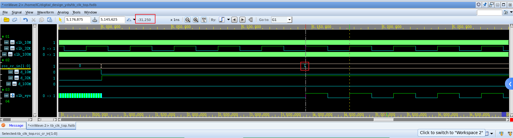

# description


# clock_gen模块

产生三种不同频率的时钟

```verilog
// -----------------------------------------------------------------------------
// Copyright (c) 2014-2023 All rights reserved
// -----------------------------------------------------------------------------
// Author : Huang Xiaochong huangxc@stu.pku.edu.cn
// File   : clock_gen.v
// Create : 2023-12-06 11:30:19
// Revise : 2023-12-06 11:36:37
// Editor : sublime text4, tab size (4)
// -----------------------------------------------------------------------------
/* Description:
	generate the clock
*/
// Version: 0.1
// -----------------------------------------------------------------------------
`timescale 1ns/1ps
module clock_gen #(
	parameter PERIOD_10M  = 100  ,
	parameter PERIOD_32K  = 31250,
	parameter PERIOD_100M = 10   
	)(
	output reg clk_10M ,
	output reg clk_32K ,
	output reg clk_100M
);

	initial begin
		clk_10M = 1'b0 ;
		# 5000 		// 5us
		forever #(PERIOD_10M / 2) clk_10M = ~clk_10M ;
	end

	initial begin
		clk_32K = 1'b0 ;
		# 5000 		// 5us
		forever #(PERIOD_32K / 2) clk_32K = ~clk_32K ;
	end

	initial begin
		clk_100M = 1'b0 ;
		# 3000000 		// 3ms
		forever #(PERIOD_100M / 2) clk_100M = ~clk_100M ;
	end

endmodule
```

# clk_switch模块

根据`rcc_cr`的值选择时钟，初始时钟为`clk_10M`

```verilog
// -----------------------------------------------------------------------------
// Copyright (c) 2014-2023 All rights reserved
// -----------------------------------------------------------------------------
// Author : Huang Xiaochong huangxc@stu.pku.edu.cn
// File   : clk_switch.v
// Create : 2023-12-06 11:22:39
// Revise : 2023-12-06 13:05:52
// Editor : sublime text4, tab size (4)
// -----------------------------------------------------------------------------
/* Description:

*/
// Version: 0.1
// -----------------------------------------------------------------------------
module clk_switch (
	input 		clk_10M        ,    // clock 10M frequency
	input 		clk_32K        ,	// clock 32K frequency
	input 		clk_100M       ,	// clock 100M frequency
	input 		rst_n	       ,    // Asynchronous reset active low
	input [1:0] rcc_cr 		   ,

	output wire clk_sys
);

/*-----------------------------------------------\
 --      	  wire & reg decleration 	        --
\-----------------------------------------------*/
	wire d_10M;
	reg [2 : 0] clk_10M_reg 	;
	reg [1 : 0] clk_10M_neg_reg ;

	wire d_32K;
	reg [2 : 0] clk_32K_reg 	;
	reg [1 : 0] clk_32K_neg_reg ;

	wire d_100M;
	reg [2 : 0] clk_100M_reg 	;
	reg [1 : 0] clk_100M_neg_reg ;

/*-----------------------------------------------\
 --         	d signal generate 	           --
\-----------------------------------------------*/
    assign d_10M  = (~rcc_cr[1] && ~rcc_cr[0]) && ~clk_32K_neg_reg[1] && ~clk_100M_neg_reg[1];
    assign d_32K  = (~rcc_cr[1] &&  rcc_cr[0]) && ~clk_10M_neg_reg[1] && ~clk_100M_neg_reg[1] ;
    assign d_100M = ( rcc_cr[1] && ~rcc_cr[0]) && ~clk_10M_neg_reg[1] && ~clk_32K_neg_reg[1] ;

/*-----------------------------------------------\
 --         sync signal generate          --
\-----------------------------------------------*/
	// clk_10M
    always @(posedge clk_10M or negedge rst_n) begin
    	if (rst_n == 1'b0) begin
    		clk_10M_reg <= 3'b111 ;
    	end
    	else begin
    		clk_10M_reg <= {clk_10M_reg[1:0], d_10M} ;
    	end
    end

    always @(negedge clk_10M or negedge rst_n) begin
    	if (rst_n == 1'b0) begin
    		clk_10M_neg_reg <= 2'b11 ;
    	end
    	else begin
    		clk_10M_neg_reg <= {clk_10M_neg_reg[0], clk_10M_reg[2]} ;
    	end
    end

    // clk_32K
    always @(posedge clk_32K or negedge rst_n) begin
    	if (rst_n == 1'b0) begin
    		clk_32K_reg <= 3'b000 ;
    	end
    	else begin
    		clk_32K_reg <= {clk_32K_reg[1:0], d_32K} ;
    	end
    end

    always @(negedge clk_32K or negedge rst_n) begin
    	if (rst_n == 1'b0) begin
    		clk_32K_neg_reg <= 2'b00 ;
    	end
    	else begin
    		clk_32K_neg_reg <= {clk_32K_neg_reg[0], clk_32K_reg[2]} ;
    	end
    end

    // clk_100M
    always @(posedge clk_100M or negedge rst_n) begin
    	if (rst_n == 1'b0) begin
    		clk_100M_reg <= 3'b000 ;
    	end
    	else begin
    		clk_100M_reg <= {clk_100M_reg[1:0], d_100M} ;
    	end
    end

    always @(negedge clk_100M or negedge rst_n) begin
    	if (rst_n == 1'b0) begin
    		clk_100M_neg_reg <= 2'b00 ;
    	end
    	else begin
    		clk_100M_neg_reg <= {clk_100M_neg_reg[0], clk_100M_reg[2]} ;
    	end
    end

/*-----------------------------------------------\
 --    		     clk_sys generate  		        --
\-----------------------------------------------*/
    wire clk_10M_gate  ;
    wire clk_32K_gate  ;
    wire clk_100M_gate ;

    and(clk_10M_gate , clk_10M , clk_10M_neg_reg[1])  ;
    and(clk_32K_gate , clk_32K , clk_32K_neg_reg[1])  ;
    and(clk_100M_gate, clk_100M, clk_100M_neg_reg[1]) ;

    or(clk_sys, clk_10M_gate, clk_32K_gate, clk_100M_gate);

endmodule
```


# rcc_cr模块

产生`rcc_cr`信号

```verilog
module rcc_cr (
	input clk_sys			,
	input rst_n  			,  // Asynchronous reset active low
	input [1:0] rcc_cr_in   ,

	output reg [1:0] rcc_cr 
);
	reg flag 	   ;
	reg [15:0] cnt ;

	always @(posedge clk_sys or negedge rst_n) begin
		if (rst_n == 1'b0) begin
			flag <= 1'b0 ;
		end
		else if (cnt == 16'd29_955) begin
			flag <= 1'b1 ;
		end
	end

	always @(posedge clk_sys or negedge rst_n) begin
		if (rst_n == 1'b0) begin
			cnt <= 16'b0000_0000_0000_0000 ;
		end
		else if (flag == 1'b0) begin
			cnt <= cnt + 1'b1 ;
		end
	end
	always @(posedge clk_sys or negedge rst_n) begin
		if (rst_n == 1'b0) begin
			rcc_cr <= 2'b00 ;
		end
		else if (flag == 1'b1) begin
			rcc_cr <= rcc_cr_in ;
		end else begin
			if (cnt  == 16'd29_955) begin
				rcc_cr <= 2'b10  ;
			end else begin
				rcc_cr <= rcc_cr ;
			end
		end
	end

endmodule
```

# clk_top模块

```verilog
module clk_top (
	input		rst_n		,  // Asynchronous reset active low
	input [1:0] rcc_cr_in   ,

	output 		clk_sys
);

	wire [1:0] rcc_cr ;
	wire 	   clk_sys;

	// generate thr clock
	parameter PERIOD_10M  = 100  ;
	parameter PERIOD_32K  = 31250;
	parameter PERIOD_100M = 10   ;

	wire clk_10M ;
	wire clk_32K ;
	wire clk_100M;

	clock_gen #(
			.PERIOD_10M(PERIOD_10M),
			.PERIOD_32K(PERIOD_32K),
			.PERIOD_100M(PERIOD_100M)
		) inst_clock_gen (
			.clk_10M  (clk_10M),
			.clk_32K  (clk_32K),
			.clk_100M (clk_100M)
		);

	// Asynchronous reset, synchronous release
	reg rst_n_sync_pre  ;
    reg rst_n_sync      ;

    always @ (posedge clk_sys or negedge rst_n) begin
        if (rst_n == 1'b0) begin
            rst_n_sync_pre <= 1'b0 ;
            rst_n_sync     <= 1'b0 ;
        end else begin
            rst_n_sync_pre  <= 1'b1 ;
            rst_n_sync      <= rst_n_sync_pre ;
        end
    end

	// switch the clock
	clk_switch inst_clk_switch
		(
			.clk_10M  (clk_10M),
			.clk_32K  (clk_32K),
			.clk_100M (clk_100M),
			.rst_n    (rst_n_sync),
			.rcc_cr   (rcc_cr),
			.clk_sys  (clk_sys)
		);

	// rcc_cr generate
	rcc_cr inst_rcc_cr 
		(
			.clk_sys(clk_sys), 
			.rst_n(rst_n_sync), 
			.rcc_cr_in(rcc_cr_in), 
			.rcc_cr(rcc_cr)
		);


endmodule
```


# Testbench

```verilog
`timescale 1ns/1ps
module tb_clk_top ();

	// asynchronous reset
	logic rst_n;
	initial begin
		rst_n <= '1;
		#2000
		rst_n <= '0;
		#500
		rst_n <= '1;
	end

	// (*NOTE*) replace reset, clock, others
	parameter  PERIOD_10M = 100;
	parameter  PERIOD_32K = 31250;
	parameter PERIOD_100M = 10;

	logic [1:0] rcc_cr_in;
	logic       clk_sys;

	clk_top #(
			.PERIOD_10M(PERIOD_10M),
			.PERIOD_32K(PERIOD_32K),
			.PERIOD_100M(PERIOD_100M)
		) inst_clk_top (
			.rst_n     (rst_n),
			.rcc_cr_in (rcc_cr_in),
			.clk_sys   (clk_sys)
		);

	task init();
		rcc_cr_in <= 2'b10;
	endtask

	task drive(int iter);
		for(int it = 0; it < iter; it++) begin
			rcc_cr_in <= it;
			# 1000000;  // 1ms
		end
	endtask

	initial begin
		// do something

		init();
		# 4_000_000 		// 4ms

		drive(3);

		# 3000 
		$finish;
	end
	// dump wave
	initial begin
		$display("random seed : %0d", $unsigned($get_initial_random_seed()));
		if ( $test$plusargs("fsdb") ) begin
			$fsdbDumpfile("tb_clk_top.fsdb");
			$fsdbDumpvars(0, "tb_clk_top");
		end
	end
endmodule

```

# waveform & analysis

- 波形如图所示


- 异步复位，同步释放


- 复位后，自动选择`clk_10M`，并开始计数，等待`clk_100M`时钟稳定


- `clk_100M`时钟稳定后，自动切换到`clk_100M`，之后计数停止，开始由`rcc_cr_in`控制时钟切换


- `rcc_cr`为00时，`d_10M`为1，选择`clk_10M`；


- `rcc_cr`为01时，`d_32K`为01，选择`clk_32K`；



- `rcc_cr`为10时，`d_100M`为1，选择`clk_100M`。


