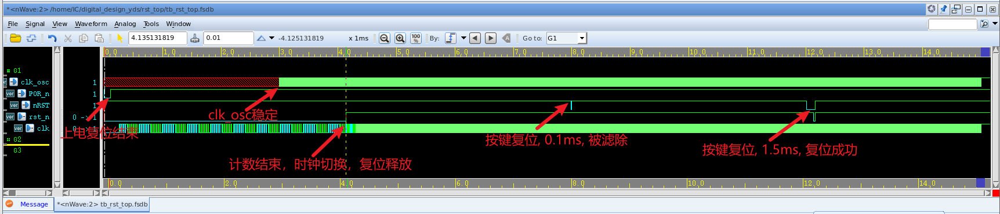
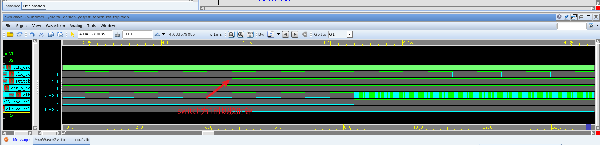
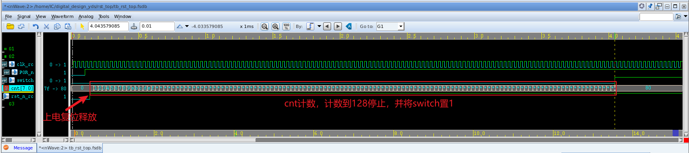
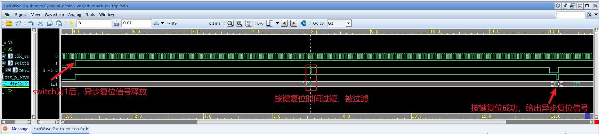
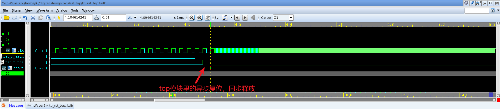
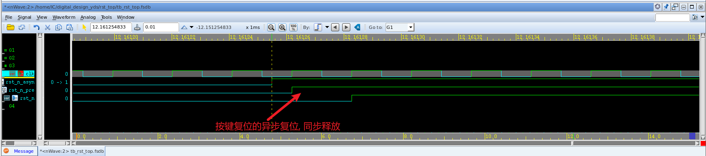

# 波形分析

整体波形




时钟切换




延时




脉冲产生




异步复位，同步释放






# tb_rst_top 模块

testbench，首先上电复位，复位释放后计数器开始计数，计数满128后，swith置1，停止计数，并将时钟切换为高频时钟`clk_osc`。之后可通过`nRST`信号按键复位，时间太短的复位信号会被滤除。

```verilog
`timescale 1ns/1ps
module tb_rst_top (); 

	// clock
	logic clk_osc;
	clock_gen #(
		.FREQUENCE(4.8e7), 
		.START_US(3_000)
		) inst_clock_gens (
		.clk(clk_osc)
		);

	// asynchronous reset
	logic nRST ;
	logic POR_n;
	initial begin
		POR_n <= '0;
		#1_000_000	// 1ms
		POR_n <= '1;
	end

	initial begin
		nRST <= '1 ;
		#8_000_000
		nRST <= '0 ;
		#10_000 	// pulse width is 0.01 ms , ignore it 
		nRST <= '1 ;
		#4_000_000
		nRST <= '0 ;
		#150_000 	// pulse width is 0.15 ms , reset
		nRST <= '1 ;
	end

	logic rst_n ;
	logic clk   ;

	rst_top inst_rst_top (
		.clk_osc(clk_osc), 
		.POR_n(POR_n), 
		.nRST (nRST),
		.rst_n(rst_n), 
		.clk(clk)
		);

	initial begin
		// do something

		#15_000_000;

		$finish;
	end
	// dump wave
	initial begin
		$display("random seed : %0d", $unsigned($get_initial_random_seed()));
		if ( $test$plusargs("fsdb") ) begin
			$fsdbDumpfile("tb_rst_top.fsdb");
			$fsdbDumpvars(0, "tb_rst_top");
		end
	end
endmodule

```


# rst_top模块

顶层模块，调用各子模块

```verilog
module rst_top (
	input clk_osc ,
	input POR_n   ,  // Asynchronous reset active low
	input nRST    ,
	
	output reg rst_n , 
	output wire clk 
);

	// rc osc
	wire clk_rc ;
	clock_gen #(
		.FREQUENCE(32768), 
		.START_US(0)
	) inst_clock_gen (
		.clk(clk_rc)
		);

	wire rst_n_rc ;

	delay inst_delay (
		.clk_rc(clk_rc), 
		.POR_n(POR_n), 
		.switch(switch),
		.rst_n_rc(rst_n_rc)
		);

	csm inst_csm (
		.clk_osc(clk_osc), 
		.clk_rc(clk_rc), 
		.switch(switch), 
		.rst_n_rc(rst_n_rc),
		.clk(clk)
		);

	pulse_gen inst_pulse_gen (
		.clk_rc(clk_rc), 
		.switch(switch), 
		.nRST(nRST), 
		.rst_n_asyn(rst_n_asyn)
		);

	reg rst_n_pre ;
	always @(posedge clk or negedge rst_n_asyn) begin
		if (rst_n_asyn == 1'b0) begin
			rst_n_pre <= 1'b0 ;
			rst_n     <= 1'b0 ;
		end
		else begin
			rst_n_pre <= 1'b1      ;
			rst_n     <= rst_n_pre ;
		end
	end

endmodule
```


# clock_gen模块

根据`FREQUENCE`和`START_US`生成不同频率以及起振时间的时钟信号

```verilog
module clock_gen #(
	parameter FREQUENCE = 4.8e7,
	parameter START_US  = 3
	)(
	output reg clk    	
);
	localparam cycle = 1.0e9/FREQUENCE ;
	localparam start = START_US * 1000 ;

	initial begin
		#(start) clk = 0;
		forever begin
			#(cycle/2) clk = ~clk ;
		end
	end

endmodule
```


# delay 模块

> POR_n 经 clk_RC 同步后，将计数器复位为 0 值。复位结束后，计数器开始计数。若晶振起振时钟为3ms，则需计数到0.003/(1/32768)=98.3。我们控制计数器计数到128，即Q[7:0]=8’b1000_0000，此时， Q7(即switch信号)值为 1，控制计数器停止计数。
>
> 
>
> switch 信号控制脉冲产生器控制复位信号变为高电平，同时控制时钟切换电路切换时钟为高频时钟，即晶振时钟 clk_OSC 。

```verilog
module delay (
	input clk_rc ,
	input POR_n  ,

	output wire switch	,
	output reg rst_n_rc
);
	

	// Asynchronous reset, synchronous release
	reg rst_n_rc_pre ;
	// reg rst_n_rc     ;

	always @(posedge clk_rc or negedge POR_n) begin
		if (POR_n == 1'b0) begin
			rst_n_rc_pre <= 1'b0 ;
			rst_n_rc     <= 1'b0 ;
		end
		else begin
			rst_n_rc_pre <= 1'b1         ;
			rst_n_rc     <= rst_n_rc_pre ;
		end
	end

	// count to 128, switch set
	reg [7:0] cnt ;
	assign switch = cnt[7] ;
	always @(posedge clk_rc or negedge rst_n_rc) begin
		if (rst_n_rc == 1'b0) begin
			cnt <= 8'b0000_0000 ;
		end
		else if (switch == 1'b0) begin
				cnt <= cnt + 1'b1 ;
			end
	end

endmodule
```


# csm模块

> switch是时钟切换控制信号，当值为0时选择clk_RC时钟输出，当值为1时，选择clk_OC时钟输出。

```verilog
module csm (
	input clk_osc,	// 48MHz
	input clk_rc ,  // 32768Hz
	input switch ,  // switch = 0, choose clk_rc
	input rst_n_rc,
	
	output wire clk	
);
	reg clk_osc_neg_r ;
	reg clk_rc_neg_r  ;

	parameter stage = 2 ;
	reg [stage-1 : 0] clk_osc_syn_r ;
	reg [stage-1 : 0] clk_rc_syn_r  ;

	wire clk_osc_sel ;
	wire clk_rc_sel  ;

	assign clk_osc_sel =  switch && ~clk_rc_neg_r ;
	assign clk_rc_sel  = ~switch && ~clk_osc_neg_r;

	// deal clk_osc 
	always @(posedge clk_osc or negedge rst_n_rc) begin
		if (rst_n_rc == 1'b0) begin
			clk_osc_syn_r <= '0;
		end else begin
			clk_osc_syn_r <= {clk_osc_syn_r[stage-2:0], clk_osc_sel};
		end
	end

	always @(negedge clk_osc or negedge rst_n_rc) begin
		if (rst_n_rc == 1'b0) begin
			clk_osc_neg_r <= '0;
		end else begin
			clk_osc_neg_r <= clk_osc_syn_r[stage-1] ;
		end
	end

	// deal clk_rc
	always @(posedge clk_rc or negedge rst_n_rc) begin
		if (rst_n_rc == 1'b0) begin
			clk_rc_syn_r <= '0 ;
		end else begin
			clk_rc_syn_r <= {clk_rc_syn_r[stage-2:0], clk_rc_sel};
		end
	end

	always @(negedge clk_rc or negedge rst_n_rc) begin
		if (rst_n_rc == 1'b0) begin
			clk_rc_neg_r <= '0 ;
		end else begin 
			clk_rc_neg_r <= clk_rc_syn_r[stage-1] ;
		end
	end
	
	// clk output
	assign clk = (clk_osc_neg_r && clk_osc) || (clk_rc_neg_r && clk_rc) ;

endmodule
```


# pulse_gen 模块

> nRST是片外的按键复位信号， 可以通过按键使芯片进行复位。但此时晶振已经正常工作，因此我们不需要再等待其起振时间。但片外按键输入的信号上可能有信号抖动，即按键按下时及松开时信号不稳定。我们使用脉冲产生电路对抖动进行过滤。

```verilog
module pulse_gen (
	input clk_rc ,    
	input switch ,  
	input nRST  ,

	output wire rst_n_asyn
);
	reg [2:0] nRST_dly ;

	always @(posedge clk_rc) begin
		nRST_dly[2:0] <= {nRST_dly[1:0], nRST} ;
	end

	wire d_rst_n ;
    assign d_rst_n = (|nRST_dly) || nRST ; // Filter burrs

	reg rst_n_r ;
	always @(posedge clk_rc) begin
		rst_n_r <= d_rst_n ;
	end

	assign rst_n_asyn = switch && rst_n_r ;

endmodule
```

