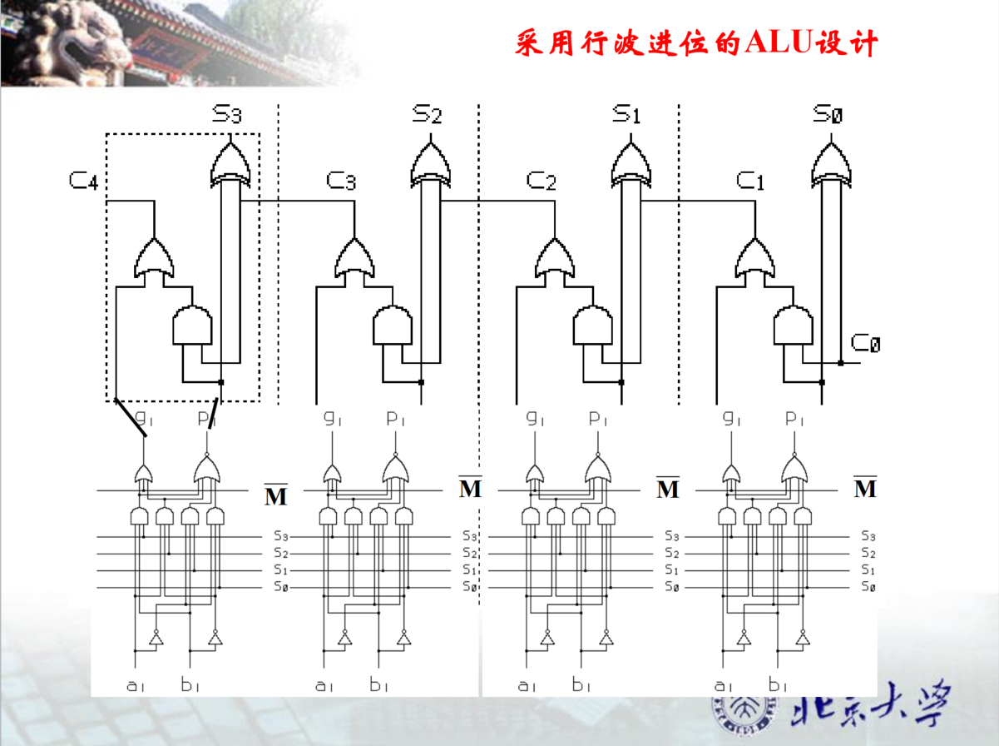
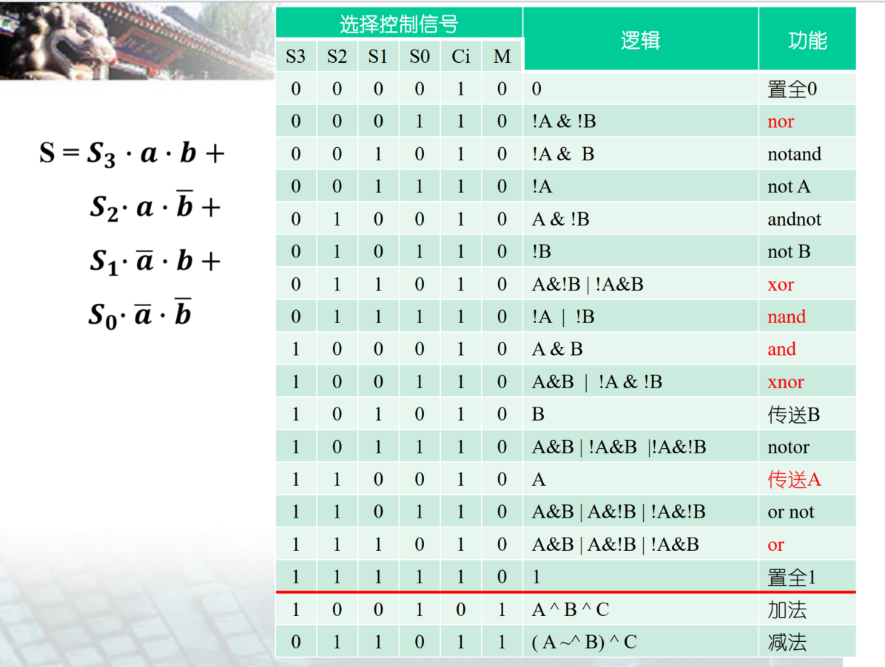
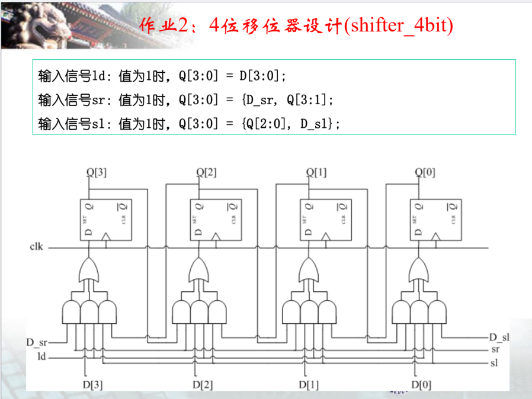
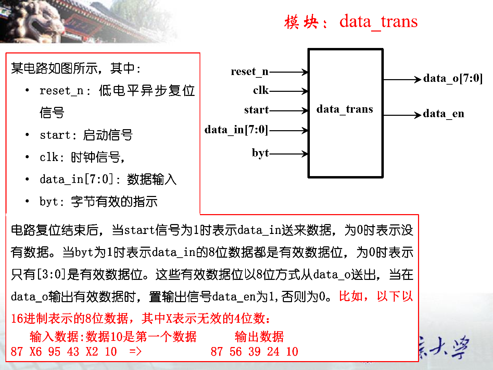
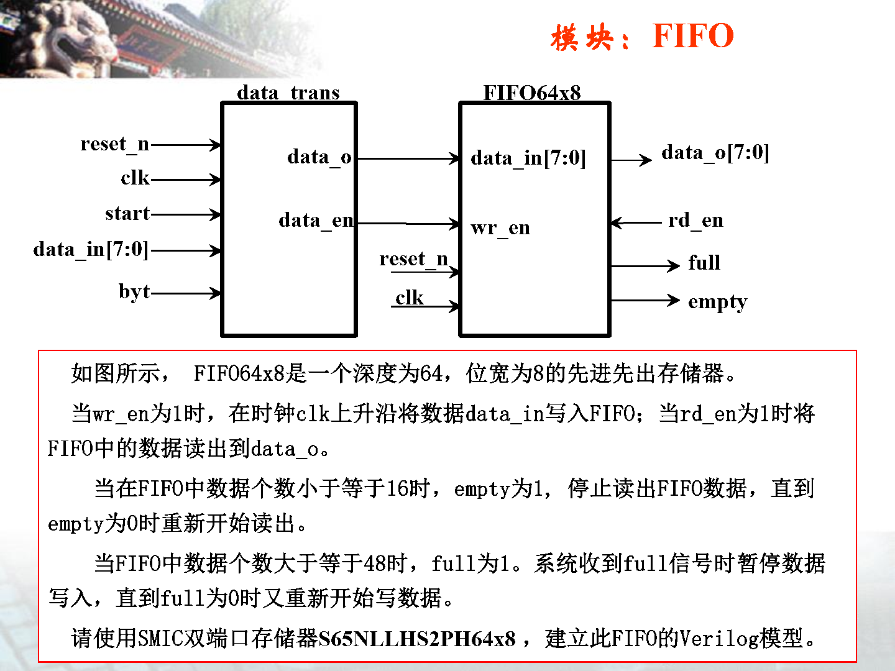
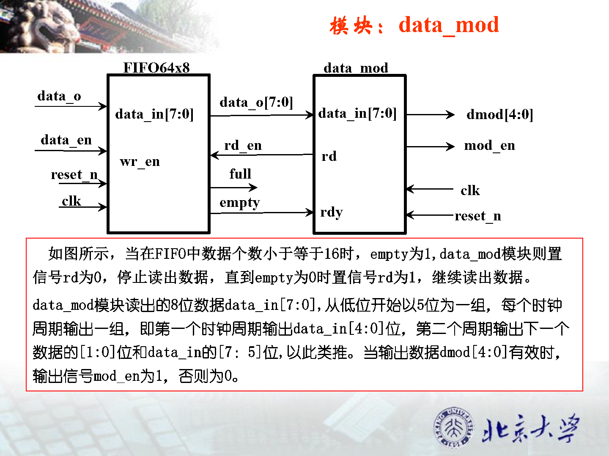
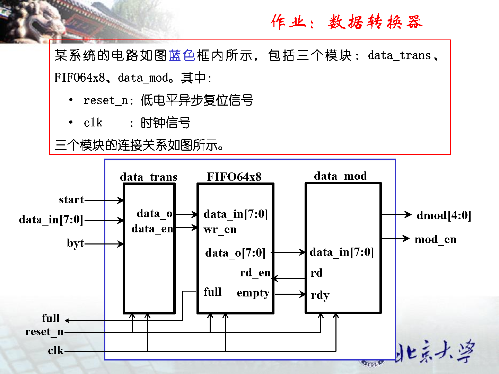

# Digital_IC_Design_23fall
Here are some assignments for digital integrated circuit design in the fall semester of 2023. Welcome to communicate and star.

📧 ： huangxc@stu.pku.edu.cn

 ## HW1_CLA_and_alu

[HW1_1024](HW1_1024)

## HW2_shifer4_and_detecte01110
[HW2_1031](HW2_1031)

## HW3_data_top
[HW3_1107](HW3_1107)

## HW4_clk_top
[HW4_1206](HW4_1206)

