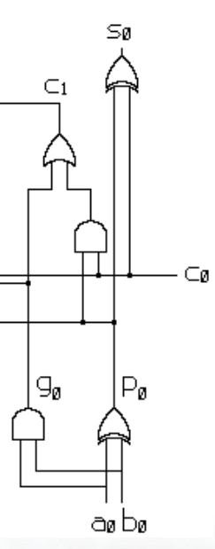
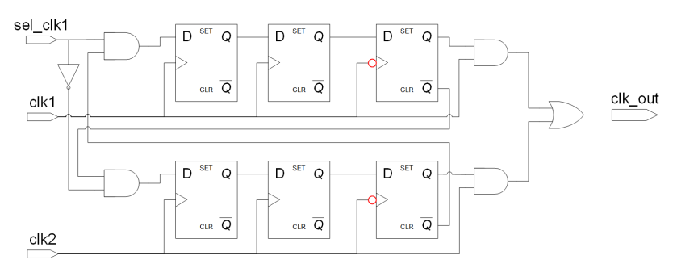
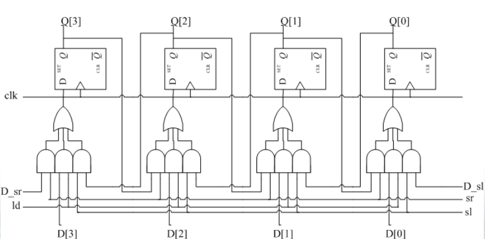

# 一、名词解释（10分）

1. false path
2. DRC
3. SDF
4. RTL
5. 异步复位，同步释放

# 二、logicand（10分）

```verilog
module logicand(
	input [3:0] A;
	input [4:0] B;
	output reg SUM
);
	assign SUM = A && B ;
endmodule
```

1. 找错`4
2. 画电路图`6

# 三、全加器结构级描述（10分）



# 四、时钟选择（20分）

` 考试未给电路图`




# 五、时序约束（10分）

1. 输入延时`3
2. 输出延时`3
3. 最大延时`2
4. 最大延时`2

# 六、shifter_4bit（10分）



# 七、数字电路为什么需要复位（10分）

# 八、SoC有哪些复位方式（10分）

# 九、if语句会产生什么电路（10分）

 